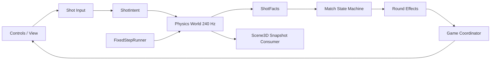

# 杆间 Phase 0 + Phase 1 可执行优化方案

> 状态：待执行  
> 规划基线：2026-07-26 06:53 CST；业务源码仍有外部进程持续写入，正式实施基线必须在 P0-00 单独冻结  
> 范围：只处理正确性、可审计性、输入一致性、响应式命中和物理时钟；不进入 Phase 2 资源与渲染性能优化

## 1. 结论先行

Phase 0 先把“规则结果”从 React 闭包中拿出来，建立纯状态机、类型门禁和 GEB 文档闭环。Phase 1 再把鼠标、触摸、键盘统一为同一个 `ShotIntent`，并让物理世界在不同刷新率下得到相同结果。

执行顺序不可颠倒：输入和时钟最终都要向规则状态机提交一杆结果；如果先改控件，现有 `Game.tsx` 的隐式状态会继续扩散。

完成后的硬结果：

1. 连续两杆进球能够正确退出开球阶段并确定球组。
2. `npm run check` 同时验证类型、单测和生产构建，不再出现 Vite 通过但 TypeScript 失败。
3. 横屏 812×375 下视角按钮真实可点击，下拉可达到 95–100 力。
4. 空格按住 1350ms 的最终力度稳定为 81±2，不受刷新率影响。
5. 同一输入在 10/30/60 FPS 调度下得到一致的最终世界快照和规则结果。
6. `Game.tsx` 不再直接包含完整规则判定和底层蓄力时钟。

## 2. 当前证据与边界

### 2.1 已确认问题

| 编号 | 现象 | 当前根因 |
| --- | --- | --- |
| R-01 | 开球进球后同一玩家再进球，仍保持开放球局 | `handleRoundEnd` 读取 `isBreak`，但 `useCallback` 依赖不含 `isBreak` |
| B-01 | 构建门禁曾出现分裂 | 06:40 曾出现 Vite 通过但 `tsc` 因 Scene3D 未使用字段失败；06:53 外部更新后 `tsc` 已恢复，但构建命令仍未串联类型检查 |
| I-01 | 横屏视角按钮不可点击 | `.table-stage` 覆盖全屏，固定顶栏 z-index 更高并遮住工具栏 |
| I-02 | 横屏最大下拉约 58 力 | 固定 `0.6/px` 映射需要 167px，实际可用距离不足 100px |
| I-03 | 空格按住 1350ms 实测约 41 力 | 最终值取自最后一次 rAF 采样，而不是松手时的真实持续时间 |
| T-01 | 低帧率下球局慢动作 | 每帧丢弃超过 50ms 的真实时间 |
| Q-01 | E2E 无法发现按钮遮挡 | 脚本使用 DOM `.click()`，绕过真实命中层 |
| G-01 | 子项目没有局部 GEB 地图和 L3 契约 | 独立 Vite 实验场尚未接入父项目文档树 |

### 2.2 保持不变的规则基线

本轮不重新讨论规则版本，先锁定当前产品基线：

- 开球后仍是开放球局。
- 开球后的第一次合法进球确定球组。
- 不要求指球定袋。
- 分组后先碰本组合法球；本组清空后才能先碰 8 号。
- 白球落袋、未碰目标、首碰非法、碰球后无进球且无球碰库均为犯规。
- 玩家犯规后 AI 获得自由球并自动放置；AI 犯规后玩家手动放置。
- 合法打进 8 号获胜；提前或伴随犯规打进 8 号失败。

若以后采用赛事级完整规则，应作为独立规则版本配置处理，不在 Phase 0 中顺手扩张。

### 2.3 明确不做

- 不做 Three.js 懒加载、纹理降级、阴影降级和包体拆分。
- 不重写物理碰撞参数。
- 不升级 React、Vite、Three.js。
- 不加入完整录像 UI、账号、联网对战或持久化。
- 不在本轮重构 AI 选杆；随机种子延后到 Phase 2。
- 不为了拆文件而制造没有职责边界的薄包装。

## 3. 目标架构



依赖方向只有一条：UI 产生意图，物理产生事实，规则产生状态迁移。规则不能调用 React setter，Scene3D 不能决定球局结果，输入层不能直接修改球的位置或速度。

### 3.1 计划目录

```text
src/
  match/
    CLAUDE.md
    types.ts
    shot-facts.ts
    match-machine.ts
    match-machine.test.ts
  input/
    CLAUDE.md
    shot-input.ts
    shot-input.test.ts
    use-shot-input.ts
  simulation/
    CLAUDE.md
    fixed-step-runner.ts
    fixed-step-runner.test.ts
    use-physics-loop.ts
  components/
    CLAUDE.md
    ViewToolbar.tsx
    AimControls.tsx
    SpinControl.tsx
    ShootControl.tsx
  styles/
    CLAUDE.md
    base.css
    layout.css
    controls.css
  Game.tsx
  Scene3D.ts
  physics.ts
  ...
```

这不是一次性全部新建。Phase 0 只建立 `match/`；Phase 1 再建立 `input/`、`simulation/`、`components/` 和 `styles/`。每新增一个目录，同一个提交内创建对应 `CLAUDE.md`。

## 4. 核心协议

### 4.1 MatchState

```ts
export type MatchPhase =
  | "intro"
  | "aiming"
  | "rolling"
  | "opponent"
  | "placing"
  | "finished";

export type MatchState = {
  phase: MatchPhase;
  actor: "player" | "opponent";
  breaking: boolean;
  playerGroup: "solid" | "stripe" | null;
  winner: "player" | "opponent" | null;
  messageKey: MatchMessageKey;
};
```

`phase`、`actor`、`breaking`、`playerGroup` 必须作为同一原子状态迁移，禁止恢复为四个互相异步的 `useState`。

### 4.2 ShotFacts

```ts
export type ShotFacts = {
  shotId: number;
  firstContact: number | null;
  pocketed: number[];
  cueScratch: boolean;
  cushionAfterFirstContact: boolean;
  remainingSolids: number;
  remainingStripes: number;
};
```

`ShotFacts` 只从物理世界和事件推导，不包含 UI 文案，也不执行 `respotCueBall`。

### 4.3 RoundResolution

```ts
export type RoundEffect =
  | { type: "auto-respot-cue" }
  | { type: "request-player-placement" }
  | { type: "schedule-opponent" };

export type RoundResolution = {
  shotId: number;
  next: MatchState;
  effects: RoundEffect[];
};
```

`resolveStoppedShot(state, facts)` 必须是纯函数。React 层只应用 `next`，协调器按顺序执行 `effects`。

### 4.4 ShotIntent

```ts
export type ShotIntent = {
  angle: number;
  power: number;
  spin: { x: number; y: number };
  source: "pointer" | "keyboard";
};
```

所有出杆路径最终只能调用一次 `commitShot(intent)`。不得保留“鼠标一套、空格一套”的最终力度算法。

## 5. Phase 0：规则正确性与可审计性

### P0-00 冻结实施基线

**目的**：阻止审计期间继续变动的代码污染实施判断。

**动作**

1. 在父仓库创建 `codex/bj8-phase01` 分支。
2. 只暂存 `bj8-optimized/` 明确允许的源码、锁文件、方案和 GEB 文档。
3. 排除 `node_modules/`、`dist/`、临时截图和父项目无关改动。
4. 记录以下基线命令输出：

```bash
git status --short
npm test
npx tsc --noEmit
npm run build
```

**验收**

- 有一个只包含当前实验场的可回滚基线提交。
- 不吸收 `../app/` 的并行修改。
- 后续每个提交都能独立回滚。

### P0-01 完成 GEB 播种

**涉及文件**

- `../CLAUDE.md`
- `CLAUDE.md`
- `src/CLAUDE.md`
- `src/match/CLAUDE.md`
- 本轮所有新增或修改业务文件的 L3 头部

**动作**

1. 父级 L1 增加 `bj8-optimized/`，声明它是独立 Vite/Three.js 实验场。
2. 校对当前目录和 `src/` 成员清单。
3. 为 `Game.tsx`、`Scene3D.ts`、`physics.ts`、新 match 文件补充 INPUT/OUTPUT/POS/PROTOCOL。
4. 只描述真实依赖方向，禁止把变量清单写成架构文档。

**验收**

- 新文件全部出现在最近的 `CLAUDE.md`。
- 触及的业务文件都有准确 L3。
- 父子链接可达，成员清单与 `rg --files` 一致。

### P0-02 建立统一质量门禁

**涉及文件**

- `package.json`
- 可选 `scripts/check-geb.mjs`

**动作**

新增命令：

```json
{
  "typecheck": "tsc --noEmit",
  "test:unit": "vitest run",
  "check": "npm run typecheck && npm run test:unit && npm run build"
}
```

保持当前 `tsc` 通过；以后若再次出现未使用字段，修正实现或删除死代码，禁止关闭 `noUnusedLocals` 逃避失败。

**验收**

- `npm run check` 为单一可信入口。
- 人为加入未使用局部变量时，门禁必须失败。
- Vite 构建不能再掩盖类型错误。

### P0-03 提取纯规则状态机

**新增文件**

- `src/match/types.ts`
- `src/match/shot-facts.ts`
- `src/match/match-machine.ts`
- `src/match/match-machine.test.ts`

**迁移内容**

- `Actor`、`ObjectGroup`、合法目标、对向球组。
- 犯规事实推导。
- 开球退出、球组归属、继续击球、回合交换。
- 自由球效果。
- 8 号球胜负。

**禁止**

- 读取 React state/ref。
- 调用 `setPhase`、`setPlayerGroup`、`setCurrentActor`。
- 修改 `BilliardsWorld`。
- 在 reducer 内调度 `setTimeout`。
- 用文案字符串作为分支条件。

**验收**

- `resolveStoppedShot` 对同一输入始终返回深相等结果。
- 当前“连续进球不分组”用例先红后绿。
- 规则测试不挂载 React、不启动 WebGL、不使用 fake DOM。

### P0-04 在 Game 中接入单一 MatchState

**涉及文件**

- `src/Game.tsx`
- `src/match/*`

**动作**

1. 用 `useReducer` 或单一 `useState<MatchState>` 替换：
   - `phase`
   - `isBreak`
   - `playerGroup`
   - `currentActor`
   - 规则型 `matchMessage`
2. 物理停止时：
   - `factsFromWorld(worldRef.current)`
   - `resolveStoppedShot(matchState, facts)`
   - 原子提交 `resolution.next`
   - 执行显式 effects
3. AI 定时器只响应 `phase === "opponent"`，卸载和状态变化时取消。
4. UI 文案由 `messageKey + params` 渲染，规则不拼 JSX 文案。

**验收**

- `Game.tsx` 中删除旧 `handleRoundEnd` 大分支。
- 不再存在依赖缺失的规则闭包。
- 相同一杆只结算一次；React StrictMode 下不重复调度 AI。
- 自由球放置和再来一局行为保持现状。

### P0-05 规则测试矩阵

至少覆盖以下用例：

| 用例 | 输入 | 期望 |
| --- | --- | --- |
| 开球未进 | 合法首碰、无犯规、无进球 | 退出开球，交换回合，仍开放 |
| 开球进球 | 合法首碰、进 1 号 | 退出开球，玩家继续，仍开放 |
| 开球后再进 | 下一杆进 2 号 | 玩家获得全色，对手花色 |
| 普通合法进球 | 先碰本组并进本组 | 当前玩家继续 |
| 普通未进 | 合法首碰且有球碰库 | 交换回合 |
| 未碰球 | `firstContact=null` | 犯规 |
| 首碰非法 | 先碰对方球 | 犯规 |
| 无进球无碰库 | 有首碰但无后续碰库 | 犯规 |
| 玩家白球落袋 | cue scratch | AI 自由球并自动放置 |
| AI 白球落袋 | cue scratch | 玩家进入 placing |
| 提前进 8 号 | 本组未清 | 当前击球者失败 |
| 清台进 8 号 | 本组已清且无犯规 | 当前击球者获胜 |
| 进 8 号同时白球落袋 | 8 号 + scratch | 当前击球者失败 |
| 重开 | 任意结束状态 | 回到初始开放开球局 |

测试断言状态码、actor、group、effects 和 winner，不把完整中文句子作为主要断言。

### P0-06 Phase 0 出口门禁

Phase 0 完成必须同时满足：

```bash
npm run check
```

- 规则矩阵全部通过。
- ego lite 手工复测“开球进球→连续进球→分组”通过。
- `Game.tsx` 不再承担规则算法。
- `Game.tsx` 目标降至 650 行以内；若未达到，不为了数字继续拆无意义文件，但必须列出剩余职责。
- GEB 正向回环：L3 → `src/CLAUDE.md` → 当前目录 `CLAUDE.md` → 父级 `CLAUDE.md`。

## 6. Phase 1：输入确定性、响应式命中与物理时钟

### P1-01 建立纯输入换算

**新增文件**

- `src/input/shot-input.ts`
- `src/input/shot-input.test.ts`

**纯函数**

```ts
powerFromDrag(startY, currentY, availableTravel): number
powerFromHold(startTime, releasedAt): number
clampSpin(pointer, bounds): CueSpin
buildShotIntent(inputState): ShotIntent
```

**规则**

- 轻点最低力度为 6。
- 拖拽力度按本次指针起点到安全底边的可用距离归一化。
- `availableTravel` 最低 72px，最高 180px。
- 到达安全底边即能产生 100 力，不要求指针越出视口。
- 空格满力时间保持 1667ms；最终值在 keyup 时重新计算。
- rAF 只负责视觉预览，绝不作为最终力度事实源。

**验收**

- 98px 可用距离拖到底得到 100。
- 1350ms 得到 81±1。
- 不同 rAF 回调次数不改变最终力度。
- pointer cancel 不出杆并恢复待机状态。

### P1-02 建立 useShotInput 协调器

**新增文件**

- `src/input/use-shot-input.ts`

**职责**

- 维护 aim、spin 和 charge session。
- 统一 pointer、touch、keyboard 的出杆出口。
- 只暴露：
  - `aim`
  - `spin`
  - `previewPower`
  - `charging`
  - `beginCharge`
  - `updateCharge`
  - `cancelCharge`
  - `releaseCharge`
  - `commitShot`

**验收**

- `Game.tsx` 中删除 `chargeRef`、`powerRafRef`、`powerRef` 和全局键盘循环。
- 每次用户动作最多提交一个 `ShotIntent`。
- disabled、rolling、opponent、placing 阶段无法绕过 `canShoot`。
- StrictMode 挂载/卸载后没有残留 rAF 或键盘监听。

### P1-03 拆分控制组件并修复横屏层级

**新增文件**

- `src/components/ViewToolbar.tsx`
- `src/components/AimControls.tsx`
- `src/components/SpinControl.tsx`
- `src/components/ShootControl.tsx`
- `src/styles/base.css`
- `src/styles/layout.css`
- `src/styles/controls.css`

**布局决策**

- 横屏定义统一尺寸变量：
  - `--topbar-h: 38px`
  - `--scoreboard-h: 34px`
  - `--hud-safe-top: 72px`
- `ViewToolbar` 的顶部不能小于 `--hud-safe-top + 8px`。
- 控件层级统一高于球桌、低于对局结束和介绍遮罩。
- 不用单纯继续增加 z-index 掩盖几何冲突。
- UI 控件的 pointerdown 必须阻止冒泡到球桌瞄准处理器。

**语义要求**

- 视角按钮使用 `aria-pressed`。
- 左右转和瞄准按钮有唯一 `aria-label`。
- `ShootControl` 可通过 Tab 聚焦，Space/Enter 行为明确。
- `SpinControl` 可聚焦，并提供键盘复位和方向调整。
- 动态力度使用 `aria-valuenow` 或等价可读文本。

**验收**

- 812×375 下 `elementFromPoint(viewButtonCenter)` 返回按钮自身。
- 390×844、812×375、1280×800 均无控制区溢出。
- 横屏下真实拖拽可产生至少 95 力。
- 点击视角按钮不会改变 aim。
- 控件焦点态肉眼可见，不依赖颜色差异判断禁用状态。

### P1-04 建立固定步调度器

**新增文件**

- `src/simulation/fixed-step-runner.ts`
- `src/simulation/fixed-step-runner.test.ts`
- `src/simulation/use-physics-loop.ts`

**算法**

```text
真实 elapsed 进入 accumulator
每步严格调用 stepWorld(world, PHYSICS_DT)
单个动画帧最多执行 60 个物理步
未处理完的 backlog 保留到后续帧，不静默丢弃
页面 hidden 时明确暂停；恢复时重置 lastTime，不补算隐藏期间时间
世界停止后只触发一次 onSettled
```

`60 × 1/240s = 250ms`，因此 4 FPS 以上仍能追上实时；10 FPS 每帧只需约 24 步。

**禁止**

- 恢复 `Math.min(0.05, realDelta)` 后直接丢弃时间。
- 为追赶时间改变 `PHYSICS_DT`。
- 在低帧率时降低碰撞精度。
- 用 Scene3D 的渲染 clock 推动物理。

**验收**

- 相同输入在 10/30/60 FPS 帧序列下，最终球状态逐字段一致或在明确浮点容差内一致。
- 页面隐藏 5 秒再恢复，不会瞬间补算 5 秒，也不会把球局永久变成慢动作。
- `onSettled` 恰好一次。
- 音效事件按物理事件顺序播放，不重复、不漏掉。

### P1-05 改造真实交互回归

**涉及文件**

- `scripts/verify-interaction.mjs`
- `package.json`

**原则**

- 启动、视角、蓄力全部用真实 mouse/touch/keyboard 事件。
- 禁止用 `element.click()` 证明用户可点击。
- DOM 读取只用于验证结果，不用于执行被测动作。

**测试矩阵**

| 视口 | 输入 | 必测结果 |
| --- | --- | --- |
| 1280×800 | mouse + keyboard | 开始、切视角、点哪打哪、拖拽出杆、1350ms 空格力度 |
| 390×844 | touch | 控件不溢出、旋转、自由球放置、满力可达 |
| 812×375 | touch | 视角按钮真实命中、横屏最大力度、控制区无遮挡 |

**新增断言**

- 实际命中元素正确。
- 出杆前后的 `ShotIntent.power` 在期望区间。
- 视角按钮状态变化。
- 点击视角按钮不改变瞄准角。
- 连续进球后球组正确。
- 页面没有未捕获错误。

本地浏览器连接地址通过 `BROWSER_URL` 配置，脚本不得硬编码唯一机器环境。E2E 仍使用现有 `puppeteer-core`，本轮不额外引入 Playwright。

### P1-06 Phase 1 出口门禁

必须同时满足：

```bash
npm run check
npm run test:interaction
```

并进行一次 ego lite 人工验收：

1. 桌面鼠标完整打一杆。
2. 空格按住约 1.35 秒，力度为 79–83。
3. 横屏触控切换俯视，再拉出 95 以上力度。
4. 模拟低刷新率，球局时间不再显著慢于现实时间。
5. AI 犯规后玩家自由球放置仍可用。

## 7. 提交顺序

每个提交都必须通过当时已有的门禁：

1. `docs: map bj8 optimized phase 0 and 1`
   - 方案、GEB 地图、基线说明。
2. `test: add match state transition matrix`
   - 先加入可失败的连续进球回归。
3. `refactor: extract pure match state machine`
   - 只做规则纯化，不改输入和布局。
4. `refactor: integrate atomic match state`
   - Game 接入，删除旧回合分支。
5. `fix: make shot input frame-rate independent`
   - 统一 ShotIntent 与蓄力算法。
6. `fix: make landscape controls reachable`
   - 控件组件、样式拆分和可访问性。
7. `fix: preserve fixed-step time across low fps`
   - 独立物理调度器。
8. `test: enforce real pointer interaction matrix`
   - 桌面、竖屏、横屏回归门禁。
9. `docs: close geb maps after phase 1`
   - L3/L2/L1 正向回环。

禁止把 Phase 0 和 Phase 1 压成一个巨型提交。

## 8. 风险与控制

| 风险 | 控制 |
| --- | --- |
| 规则迁移时改变现有产品规则 | 先写规则基线和旧行为测试，再修已确认 bug |
| React state 与 worldRef 不一致 | 物理世界只存球状态，MatchState 只存规则状态；一杆只在 settled 边界交汇 |
| effects 重复执行 | resolution 带唯一 shot id，协调器记录最后处理 id |
| StrictMode 重复注册监听或 AI 定时器 | hooks 必须有对称 cleanup，并写挂载卸载测试 |
| 横屏修复破坏桌面视觉 | CSS 变量限定媒体查询，三视口截图和真实命中同时验证 |
| 追赶物理导致单帧卡顿 | 每帧最多 60 步并保留 backlog；Phase 2 再考虑 Worker |
| 父项目与实验场继续双轨漂移 | 本轮明确只改 `bj8-optimized`，父 `app/` 仅作为边界参考，不复制实现 |
| 并行外部修改覆盖实施 | P0-00 后冻结基线；发现 mtime 或工作树变化立即停止合并 |

## 9. 工作量估算

| 阶段 | 预计专注工时 | 主要产物 |
| --- | --- | --- |
| Phase 0 | 2.5–3.5 人日 | GEB、类型门禁、纯规则状态机、规则矩阵、Game 接入 |
| Phase 1 | 3–4 人日 | ShotIntent、控制组件、横屏修复、固定步调度器、真实交互回归 |
| 缓冲 | 1 人日 | 移动端差异、StrictMode、规则边界与回归修复 |

总计约 6.5–8.5 个专注人日。若只追求“修掉眼前 bug”会更快，但会保留状态和输入双重腐烂源，不建议。

## 10. 最终 Definition of Done

- [ ] `npm run check` 通过。
- [ ] `npm run test:interaction` 在三种视口通过。
- [ ] 连续进球正确分组。
- [ ] 所有规则迁移由纯函数测试覆盖。
- [ ] 空格和拖拽力度与刷新率、视口高度解耦。
- [ ] 10/30/60 FPS 最终物理快照一致。
- [ ] 横屏视角按钮真实可点击，最大力度不低于 95。
- [ ] 自由球、AI 回合、8 号胜负无回归。
- [ ] `Game.tsx` 不再包含完整规则算法和底层 charge clock。
- [ ] 所有触及文件具备准确 L3，所有新增目录具备 L2。
- [ ] 当前目录与父项目地图完成 GEB 正向回环。
- [ ] 每个提交可独立回滚，未吸收父项目无关修改。

## 11. 开工前唯一检查点

执行前先确认工作树不再被其他进程同时修改。确认后从 P0-00 开始，不直接跳到控件或 CSS 修补。

[PROTOCOL]: 变更时更新此头部，然后检查 CLAUDE.md
