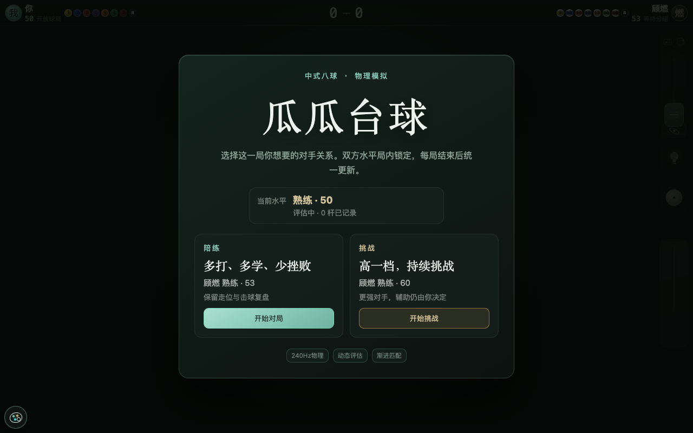
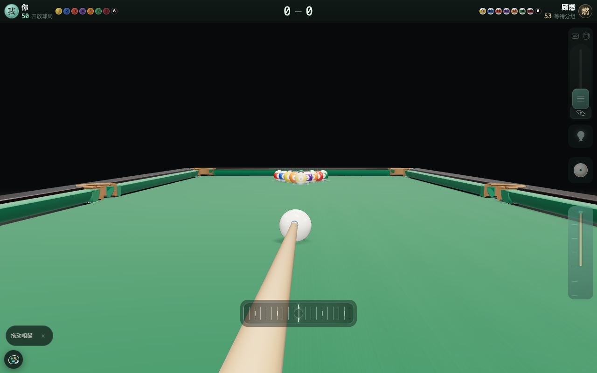
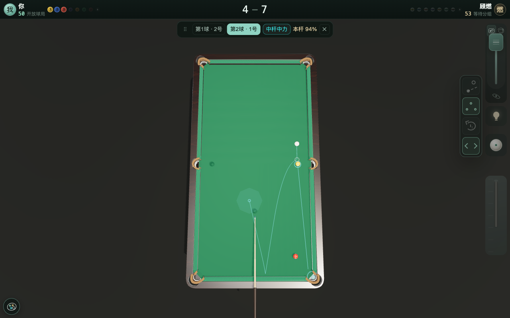
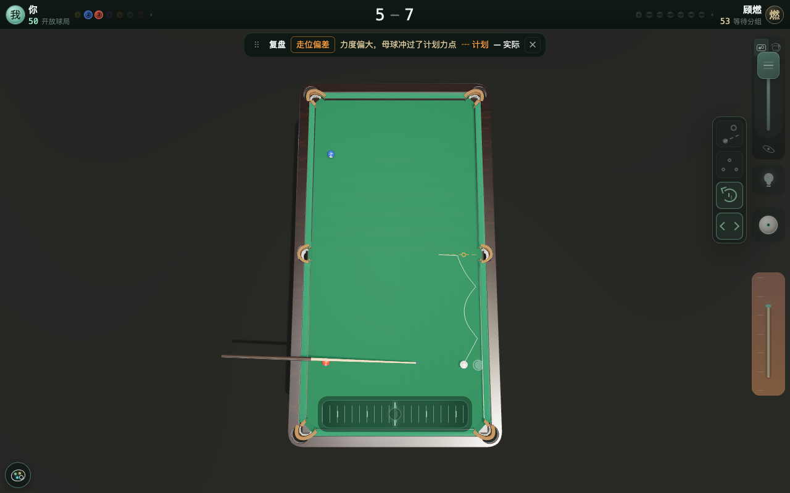
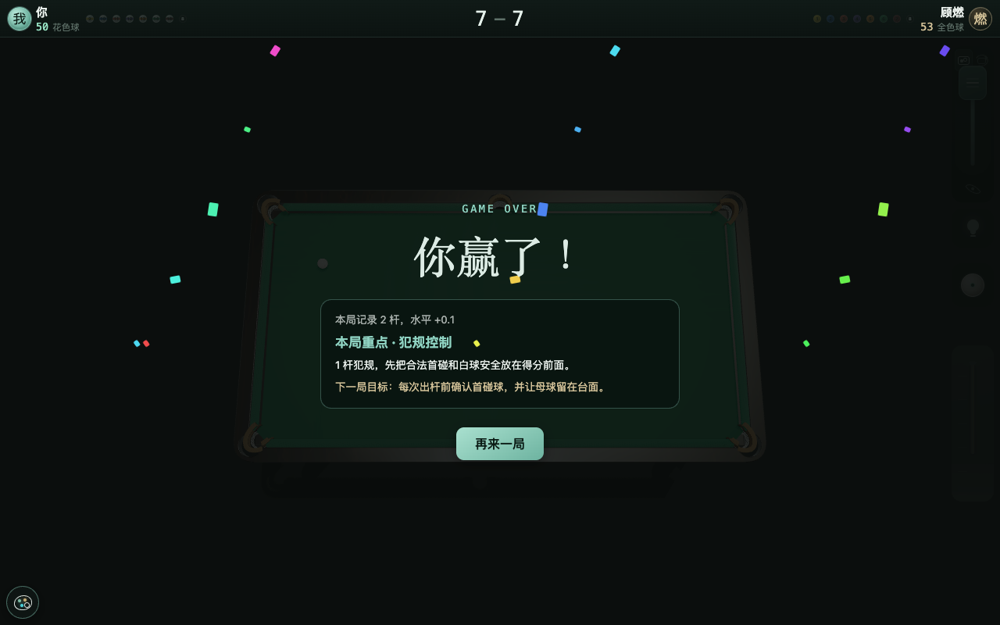
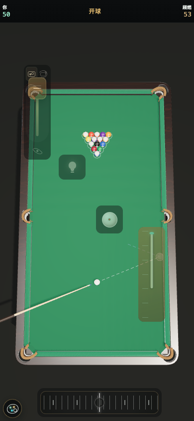
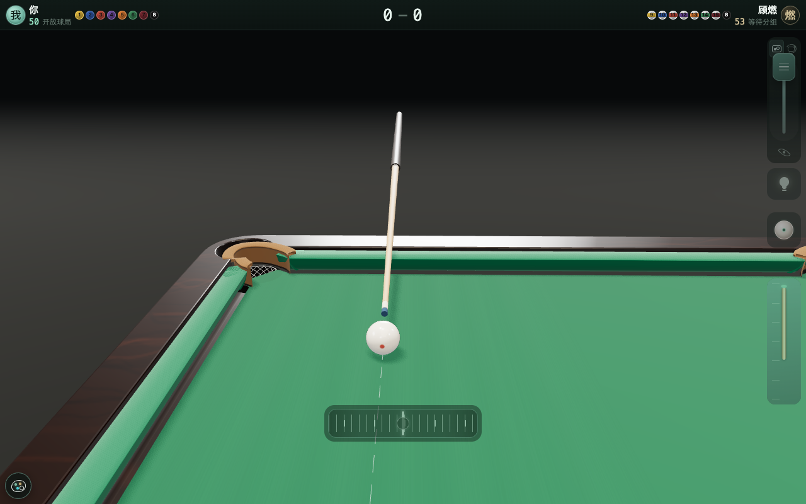

# 我用 Kimi K3 写了个浏览器里的 3D 中式八球

> 既有线上体验（当前发布版本可能早于本文 `v1.4.0` 快照）：https://lg22l37ytz.aiforce.cloud/app/app_17b18dh5axj
> 权威代码仓库：https://github.com/ZGG277/bj8-optimized



「瓜瓜台球」是跑在浏览器里的 3D 中式八球单机游戏，Vite + React + Three.js，没有后端。点开链接，摆球、瞄准、下拉蓄力、松手出杆，碰撞、反弹、加塞、落袋都由本地 240Hz 物理内核算出来。

## 为什么做这个游戏

我喜欢打台球，但手机上的台球小游戏都要看广告，还全是平面大球，没有真实感。我想要一个干净的、第一人称的 3D 台球：随时打开随时玩，顺便练观察球局和规划击球路线的思路。找不到现成的，就和 Kimi 一起做了这个网页版。现在我每天玩几局，现实里握杆的思路和感觉都有提升。

这篇分两块：玩起来什么样；技术栈与规模。

---

## 一、玩起来什么样

### 1. 真 3D 连续视角切换

3D 仿真球台，灯光、球桌、边库、台面、袋口、球体，通过 3D 渲染模拟真实台球场景。横向 360° 环球台旋转视角、纵向视角推到任意高度进行球局观察，全视角覆盖。对手击球系统自动锁全台俯视观察台面，击球可调节到俯身第一人称击球视角，感受真实球路形态和出杆角度。



### 2. 瞄准：拨轮、粗瞄和精瞄

设置横向拨轮键解决瞄准问题，粗瞄滑动拨轮可快速调节击球方向，也可以直接点台面目标点放置母球幽灵球，快速锁定大致击球方向。拨轮扫过袋口不吸附、不自动变档，手感从头到尾一致。想薄一颗贴库球时，按压拨轮则自动进 1/8 传动的精瞄档，微调寻找进球角度。同时也保留了切换为球杆两侧的方向键瞄准：单击固定约 0.23°，长按低速连续微调。

### 3. 走位规划与击球复盘

练习走位思路作为高阶功能，开关藏在小灯泡按钮里，点亮灯泡并开启规划，规划引擎会实时根据球局给出概率最高的几条分杆路线建议：「第 1 球·2 号 → 第 2 球·1 号」这样的连贯计划，当前产品最多看 2 步，每杆的成功率、杆法力度和完整轨迹直接画在当前的球桌上，球路一眼看清。每杆会在后台生成复盘诊断；从灯泡开启“复盘”后，才显示实际击球与规划路线偏差和建议。





### 4. 水平评估与动态调节

系统玩家顾燃，会按照玩家一局的真实出杆评估实力。评估分两个维度：击球准度（相对每杆难度的执行分）和白球走位（可评估走位杆的到位率），加权合成综合分；带 Beta(2,2) 先验，避免冷启动被一杆好坏带偏。

证据不足时评分向中性 50 收缩，打得越多越敢评。陪练模式顾燃强你 3 分、挑战模式强你 10 分，整局锁定、不在局中抖动，局末统一计算。



### 5. 耗能问题：玩两局就烫，怎么治

发现手机上打两局就发热，电脑端跑起来风扇也呼呼响。Kimi 分析后反馈根源是 GPU 满负荷空转。优化了多次：开局页不启动 WebGL，点开始才装配 Three.js；球桌静止、相机收敛就停 rAF，不一秒一秒白跑。

运行中由热管理状态机读 GPU timer 的单帧耗时（不支持的设备用 CPU 兜底），结合掉帧率判断真实负载：持续高压才从 balanced 升到 warm、hot，带滞回、不来回跳，静止后自动恢复。降档只降像素比、阴影和展示帧率，240Hz 物理和输入采样保持，手机端尽量保持清晰度。



### 6. 袋口：看着能进就能进

袋口部分的优化也是一个难题，视觉上模拟真实质感，物理碰撞也要合理，这部分 Kimi 调研了不少成熟方案，后来拍摄了真实球台的照片，给 Kimi 参考。最终采用物理和视觉用同一份袋口参数：角袋 100mm、中袋 102mm，台内凹弧、皮护口、细缝边、菱形网，让瞄准线、视觉袋口与实际落袋判定保持同一套几何依据。



---

## 二、技术栈与规模

- Vite + React 18 + TypeScript + Three.js（0.185），零后端，构建产物为单 HTML 入口
- 约 2.2 万行源码（含测试），34 个 Vitest 测试文件，16 个浏览器回归脚本
- 关键目录：physics/（物理内核）、match/（规则状态机）、planner/（走位规划）、opponent/（系统对手）、input/（出杆输入）、layout/（控件布局）。

代码已开源到 GitHub：https://github.com/ZGG277/bj8-optimized。`guagua-pool-share` 仅作为发布本案例时的 `v1.4.0` 冻结快照。

```bash
git clone https://github.com/ZGG277/bj8-optimized.git
cd bj8-optimized
npm ci
npm run dev        # http://localhost:5173
```

欢迎体验，并分享您的建议。
